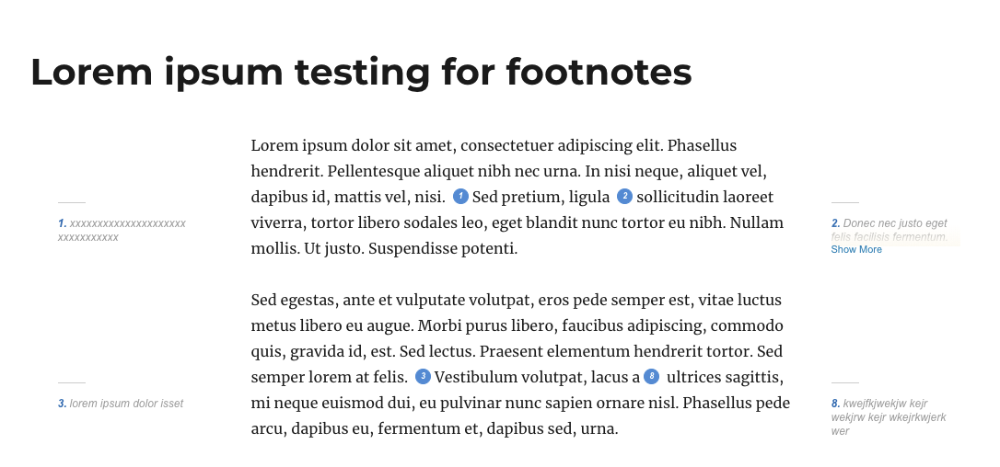
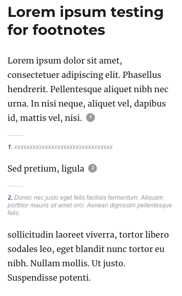

# Smart footnote plugin

This is a plugin made for Mcgill Law Journal project.

This plugin add a footnote button to the tynimce on wordpress. Click the button to add a footnote at the cursor position.

The footnote will have two fields:

* Reference
* Content

Once created, you can click the footnote to edit or delete.

---

## Plugin settings

Under **Setting/Smart Footnote** you can configure the text for *Show more* and Show *less links*.

Also, configure the *max-width* media query.

In the front-end, over the *max-width* the footnotes will float absolutly left and right of the article.

Under the *max-width* the footnote will appear in the next line when clicked.

---

##Translation

To translate the *Show more* and *Show less* toggle, use the .po file inside the plugin languages folder.
